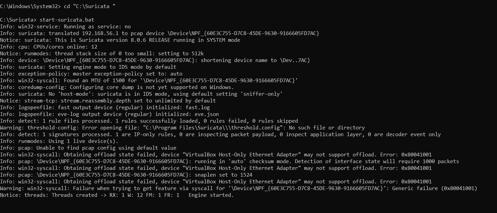
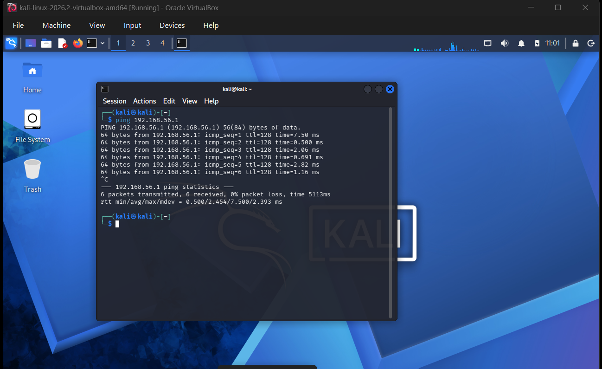
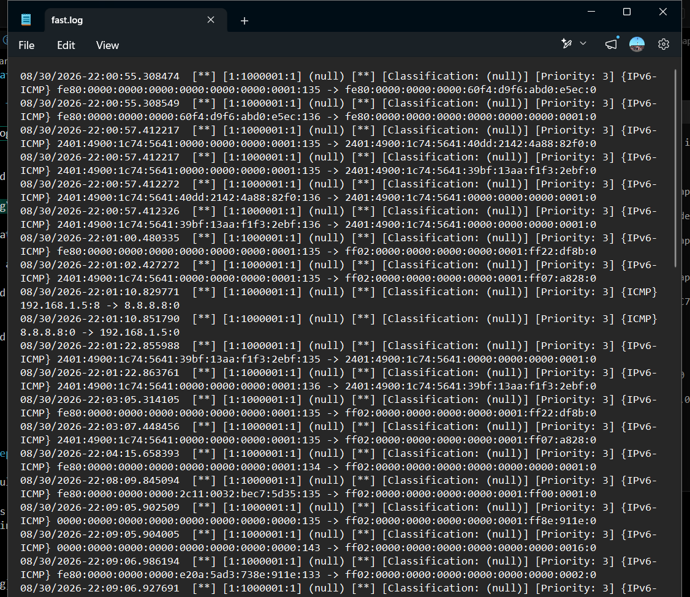
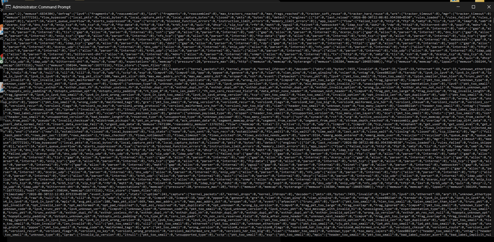
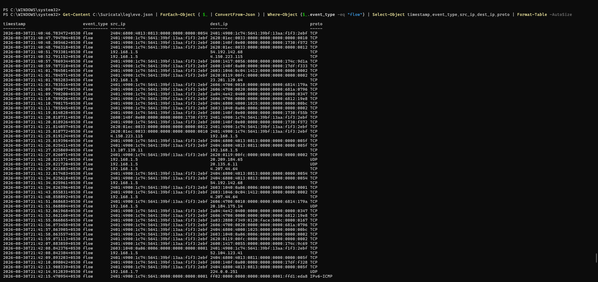
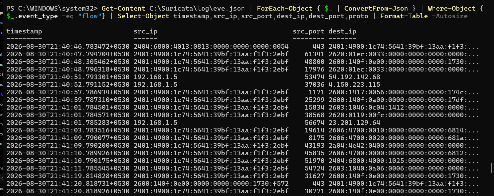
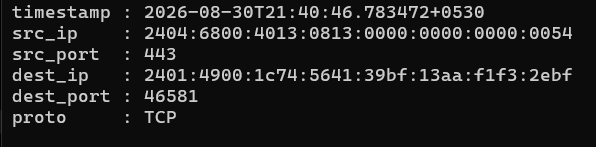

# Lab 02: Understanding Suricata EVE JSON

## 🎯 Objective

The objective of this lab is to understand how Suricata records
network activity in `eve.json` and how a SOC analyst can process,
filter, and investigate that telemetry using PowerShell.

The main focus of this lab is:

- Understanding EVE JSON
- Understanding Suricata event types
- Understanding `flow` and `alert` events
- Understanding important network fields
- Processing JSON using PowerShell
- Filtering relevant events
- Separating lab traffic from unrelated network traffic
- Understanding how Suricata telemetry can be used during SOC investigation

The goal is **understanding rather than memorizing commands**.

---

# 🏗️ Lab Environment

## Kali Linux

IP Address:

    192.168.56.103

Used to generate controlled network traffic.

---

## Windows

Host-only IP Address:

    192.168.56.1

Windows acts as the Suricata sensor/monitoring system.

---

## Suricata

Installation directory:

    C:\Suricata\

Configuration:

    C:\Suricata\suricata.yaml

Rules:

    C:\Suricata\rules\local.rules

Logs:

    C:\Suricata\log\

EVE JSON:

    C:\Suricata\log\eve.json

---

## Npcap

Npcap is used by Suricata to capture network traffic on Windows.

---

## PowerShell

PowerShell is used to process and investigate the structured
JSON telemetry generated by Suricata.

---

# 🔄 Overall Lab Architecture

The complete telemetry flow is:

    Kali Linux
    192.168.56.103
          |
          | Network Traffic
          v
    Host-Only Network
          |
          v
    Windows
    192.168.56.1
          |
          v
        Npcap
          |
          v
      Suricata
          |
          +------------------+
          |                  |
          v                  v
      fast.log           eve.json
                             |
                             v
                         PowerShell
                             |
                             v
                    Filter / Extract
                             |
                             v
                      SOC Investigation

---

# 1. Start Suricata

Suricata was started using the previously created startup batch file:

    C:\Suricata\start-suricata.bat

The batch file contains:

    @echo off
    cd /d C:\Suricata
    suricata.exe -c C:\Suricata\suricata.yaml -i 192.168.56.1
    pause

After starting Suricata, the console displayed:

    Engine started

This confirmed that the Suricata engine was running and monitoring
the configured network interface.

### Important

When Suricata is running in the foreground and displays:

    Engine started

the window should be left running.

Other CMD/PowerShell windows can then be used for log investigation.

### Evidence

---

# 2. Generate Controlled Traffic from Kali

To give Suricata network traffic to observe, controlled ICMP traffic
was generated from Kali Linux toward the Windows host.

### Kali

    192.168.56.103

### Windows

    192.168.56.1

### Command

    ping 192.168.56.1

The ping was allowed to run for a few seconds and then stopped using:

    Ctrl + C

### Traffic Flow

    Kali
    192.168.56.103
          |
          | ICMP
          v
    Windows
    192.168.56.1

This traffic gives Suricata something to observe and record.

### Evidence

---

# 3. Verify the Traffic at Packet Level

TShark/Wireshark was used during the lab to verify that the traffic
was actually present on the network.

TShark interface discovery was performed using:

    "C:\Program Files\Wireshark\tshark.exe" -D

This displayed the available capture interfaces.

A capture filter was then used for ICMP traffic:

    "C:\Program Files\Wireshark\tshark.exe" -i 8 -f "icmp"

The important concept learned here was:

    Traffic exists on the network
            ↓
    Packet capture can observe it
            ↓
    Suricata can analyze it

### Important Observation

The TShark interface number is not necessarily the same as the
Windows PowerShell `InterfaceIndex`.

For example:

    Windows InterfaceIndex ≠ TShark Interface Number

They identify interfaces using different mechanisms.

---

# 4. View Suricata fast.log

Suricata's `fast.log` provides a quick human-readable view of
security alerts.

The file is located at:

    C:\Suricata\log\fast.log

The previously created ICMP detection rule was:

    alert icmp any any -> any any (msg:"ICMP_TEST"; sid:1000001; rev:1;)

When the controlled ICMP traffic matched the rule, Suricata generated
an alert.

The alert contained information such as:

    ICMP_TEST
    SID:1000001
    Source IP
    Destination IP
    Timestamp

### Important Concept

`fast.log` is useful for quickly seeing alerts.

`eve.json` provides much more structured telemetry and is better
suited for processing and SIEM integration.

### Evidence

---

# 5. View the Raw EVE JSON

Suricata stores structured event information in:

    C:\Suricata\log\eve.json

The raw EVE JSON file was viewed from Windows CMD using:

    type C:\Suricata\log\eve.json

The output contained a large amount of JSON data.

Different event types can appear in the file, including:

    flow
    alert
    netflow
    stats

Other protocol-specific event types can also appear depending on
the traffic and Suricata configuration.

### Problem

The raw output is designed primarily for machines and security tools.

It can be difficult for a human analyst to read directly from the
terminal.

### Evidence

---

# 6. Understanding the Problem with Raw JSON

The EVE JSON file can contain a large amount of information.

An event can contain fields such as:

    timestamp
    event_type
    src_ip
    src_port
    dest_ip
    dest_port
    proto

Reading the entire file manually is inefficient.

Therefore, PowerShell was introduced to process the telemetry.

The objective was not to memorize one huge command.

Instead, the command was built step-by-step.

---

# 7. PowerShell — Get-Content

The first PowerShell command introduced was:

    Get-Content C:\Suricata\log\eve.json

### Purpose

`Get-Content` reads the contents of a file.

Concept:

    Get-Content
         ↓
    Read eve.json

This is similar to:

    type C:\Suricata\log\eve.json

in Windows CMD.

---

# 8. PowerShell — Search the Log

A simple search was performed using:

    Get-Content C:\Suricata\log\eve.json | Select-String "ICMP"

### Breakdown

    Get-Content
        ↓
    Read eve.json
        ↓
    |
        ↓
    Pass output to next command
        ↓
    Select-String
        ↓
    Search for ICMP

This introduced the idea that PowerShell commands can be combined
to investigate logs.

---

# 9. PowerShell Pipeline

The PowerShell pipeline symbol is:

    |

The pipeline passes the output of one command to another command.

Example:

    Get-Content C:\Suricata\log\eve.json | Select-String "ICMP"

Concept:

    Command 1
       ↓
    Output
       ↓
       |
       ↓
    Command 2

This is extremely useful during log investigation because data
can be processed step-by-step.

---

# 10. PowerShell — ConvertFrom-Json

The next concept introduced was:

    ConvertFrom-Json

Suricata's EVE file contains JSON data.

`ConvertFrom-Json` converts JSON text into PowerShell objects.

Command:

    Get-Content C:\Suricata\log\eve.json | ForEach-Object { $_ | ConvertFrom-Json }

### Concept

    JSON text
        ↓
    ConvertFrom-Json
        ↓
    PowerShell object
        ↓
    Fields become accessible

Instead of treating JSON as plain text, PowerShell can now work
with individual fields.

---

# 11. Understanding `$_` and `ForEach-Object`

The command:

    ForEach-Object { $_ | ConvertFrom-Json }

processes the log line-by-line.

Conceptually:

    eve.json
       ↓
    One JSON line
       ↓
    $_
       ↓
    ConvertFrom-Json
       ↓
    PowerShell object

The important idea is:

    ForEach-Object = process each item

and:

    $_ = the current item being processed

This is more important than memorizing the complete command.

---

# 12. PowerShell — Select-Object

After converting the JSON into PowerShell objects, specific fields
can be selected.

Command:

    Get-Content C:\Suricata\log\eve.json | ForEach-Object { $_ | ConvertFrom-Json } | Select-Object timestamp,event_type,src_ip,dest_ip,proto

Fields selected:

    timestamp
    event_type
    src_ip
    dest_ip
    proto

### Purpose

`Select-Object` extracts only the fields required for the investigation.

Instead of looking at every field in an EVE event, the analyst can
focus on useful evidence.

---

# 13. PowerShell — Format-Table

The output can be made easier to read using:

    Format-Table -AutoSize

Complete command:

    Get-Content C:\Suricata\log\eve.json | ForEach-Object { $_ | ConvertFrom-Json } | Select-Object timestamp,event_type,src_ip,dest_ip,proto | Format-Table -AutoSize

### Purpose

`Format-Table -AutoSize` displays the selected information in a
more readable table.

### Evidence

---

# 14. Understanding the PowerShell Investigation Pipeline

The large command can be understood as smaller building blocks:

    Get-Content
         ↓
    Read the file
         ↓
    ForEach-Object
         ↓
    Process each JSON line
         ↓
    ConvertFrom-Json
         ↓
    Convert JSON into objects
         ↓
    Select-Object
         ↓
    Extract useful fields
         ↓
    Format-Table
         ↓
    Display readable output

Therefore, the command should not be memorized as one huge command.

The methodology is:

    Read
     ↓
    Parse
     ↓
    Filter
     ↓
    Extract
     ↓
    Display
     ↓
    Investigate

---

# 15. PowerShell — Understand Event Types

To see the event types generated by Suricata:

    Get-Content C:\Suricata\log\eve.json | ForEach-Object { $_ | ConvertFrom-Json } | Select-Object event_type

This allows us to see the different types of telemetry being
recorded.

Examples:

    flow
    alert
    netflow
    stats

### Why this matters

Before investigating an event, a SOC analyst needs to understand
what type of telemetry it represents.

---

# 16. PowerShell — Count Event Types

To group and count the event types:

    Get-Content C:\Suricata\log\eve.json | ForEach-Object { $_ | ConvertFrom-Json } | Group-Object event_type

### Purpose

`Group-Object` groups similar values together and provides a count.

Concept:

    event_type values
          ↓
    Group-Object
          ↓
    flow     → count
    alert    → count
    stats    → count
    netflow  → count

This helps understand what kind of telemetry is present in the log.

---

# 17. PowerShell — Filter Flow Events

To investigate only network flow events:

    Get-Content C:\Suricata\log\eve.json | ForEach-Object { $_ | ConvertFrom-Json } | Where-Object {$_.event_type -eq "flow"} | Select-Object timestamp,src_ip,src_port,dest_ip,dest_port,proto

### Purpose

This command answers:

> Show me only events where `event_type` is `flow`.

The filtering logic is:

    event_type
        ↓
    Is it equal to "flow"?
        ↓
    YES → keep
    NO  → discard

---

# 18. Understanding Flow Fields

The important fields investigated were:

### timestamp

    timestamp = WHEN

It tells us when the event occurred.

---

### src_ip

    src_ip = SOURCE

It identifies the source of the communication.

---

### src_port

    src_port = SOURCE PORT

It identifies the source-side port.

---

### dest_ip

    dest_ip = DESTINATION

It identifies where the communication was going.

---

### dest_port

    dest_port = DESTINATION PORT

It identifies the destination-side port/service.

---

### proto

    proto = PROTOCOL

Examples include:

    TCP
    UDP
    ICMP

---

# 19. SOC Question — Who Communicated With Whom?

For our controlled lab traffic, the expected communication is:

    Source:
    192.168.56.103

    Destination:
    192.168.56.1

    Protocol:
    ICMP

Therefore:

    Kali → Windows
    192.168.56.103 → 192.168.56.1

This demonstrates how a SOC analyst can reconstruct basic network
communication from telemetry.

---

# 20. Important Observation — EVE JSON Contains Other Traffic Too

During investigation, a different event was observed containing:

    src_ip  : 2404:6800:4013:0813:0000:0000:0000:0054
    src_port: 443
    dest_ip : 2401:4900:1c74:5641:39bf:13aa:f1f3:2ebf
    dest_port: 46581
    proto   : TCP

These are IPv6 addresses rather than the IPv4 addresses used by
our controlled Kali → Windows lab traffic.

The source port was:

    443

This is associated with HTTPS traffic.

### Important SOC Lesson

`eve.json` can contain traffic other than the traffic generated
specifically for our lab exercise.

Therefore, an analyst should not assume that every event in the log
belongs to the investigation.

This introduced an important SOC skill:

    Large telemetry
         ↓
    Identify relevant traffic
         ↓
    Filter by IP / protocol / event type
         ↓
    Investigate only relevant evidence

---

# 21. Filter Only Kali → Windows Traffic

To isolate our controlled lab traffic:

    Get-Content C:\Suricata\log\eve.json | ForEach-Object { $_ | ConvertFrom-Json } | Where-Object {$_.src_ip -eq "192.168.56.103" -and $_.dest_ip -eq "192.168.56.1"} | Select-Object timestamp,event_type,src_ip,src_port,dest_ip,dest_port,proto

### Purpose

This filter specifically searches for:

    Source = 192.168.56.103
        AND
    Destination = 192.168.56.1

This removes unrelated traffic from the immediate investigation.

### SOC Methodology

Instead of asking:

    "What is everything in the log?"

we ask:

    "Which events are relevant to my investigation?"

This is a major difference between simply reading logs and performing
SOC analysis.

---

# 22. Flow vs Alert

One of the most important concepts learned in this lab was the
difference between `flow` and `alert`.

## FLOW

A `flow` event indicates that Suricata observed network communication.

Concept:

    Network communication
            ↓
        Suricata
            ↓
          FLOW

A flow does NOT automatically mean that the traffic is malicious.

---

## ALERT

An `alert` event means that a Suricata detection rule matched
the traffic.

Concept:

    Network communication
            ↓
        Suricata
            ↓
       Detection Rule
            ↓
          MATCH
            ↓
          ALERT

Therefore:

    FLOW  = Communication was observed

    ALERT = A detection rule matched

---

# 23. PowerShell — Find Actual Alerts

To investigate only alert events:

    Get-Content C:\Suricata\log\eve.json | ForEach-Object { $_ | ConvertFrom-Json } | Where-Object {$_.event_type -eq "alert"} | Select-Object timestamp,src_ip,src_port,dest_ip,dest_port,proto,alert

This focuses the investigation on Suricata detections.

The alert generated by the previously created rule should contain
information related to:

    ICMP_TEST

and:

    SID: 1000001

depending on the current contents of the log.

---

# 24. Investigating the Alert

When an alert is found, the analyst should extract:

    timestamp
    src_ip
    src_port
    dest_ip
    dest_port
    proto
    alert information

Then ask:

    Who initiated the communication?
    What was the destination?
    What protocol was used?
    When did it happen?
    Which rule generated the alert?
    Why did the rule match?
    Is the activity actually malicious?

---

# 25. Critical SOC Lesson — ALERT ≠ ATTACK

The controlled ICMP alert was generated intentionally in this lab.

Therefore:

    ALERT
      ↓
    INVESTIGATE
      ↓
    Add context
      ↓
    Determine classification
      ↓
    True Positive / False Positive / Benign Activity

The existence of an alert alone does not prove that an attack
occurred.

A SOC analyst must investigate the context.

For this lab:

    ICMP_TEST alert
          ↓
    Traffic generated intentionally
          ↓
    Known lab activity
          ↓
    Benign controlled activity

---

# 26. Compare Flow and Alert

## Flow Investigation

    Get-Content C:\Suricata\log\eve.json | ForEach-Object { $_ | ConvertFrom-Json } | Where-Object {$_.event_type -eq "flow"} | Select-Object timestamp,src_ip,src_port,dest_ip,dest_port,proto | Format-Table -AutoSize

This answers:

    What communication did Suricata observe?

---

## Alert Investigation

    Get-Content C:\Suricata\log\eve.json | ForEach-Object { $_ | ConvertFrom-Json } | Where-Object {$_.event_type -eq "alert"} | Select-Object timestamp,src_ip,src_port,dest_ip,dest_port,proto,alert | Format-Table -AutoSize

This answers:

    Which observed communication triggered a detection rule?

---

# 27. Detection Chain

The complete detection chain understood during this lab is:

    Kali
      ↓
    Generate ICMP traffic
      ↓
    Npcap captures traffic
      ↓
    Suricata receives traffic
      ↓
    Suricata checks rules
      ↓
    ICMP_TEST rule matches
      ↓
    Alert generated
      ↓
    fast.log + eve.json
      ↓
    PowerShell processes EVE JSON
      ↓
    Relevant fields extracted
      ↓
    SOC analyst investigates

---

# 28. Complete EVE Investigation Pipeline

The investigation methodology developed in this lab is:

    eve.json
       ↓
    Get-Content
       ↓
    Read log
       ↓
    ConvertFrom-Json
       ↓
    Convert JSON into objects
       ↓
    Where-Object
       ↓
    Filter relevant events
       ↓
    Select-Object
       ↓
    Extract useful fields
       ↓
    Format-Table
       ↓
    Human-readable telemetry
       ↓
    Investigate
       ↓
    Determine context

---

# 29. SOC Investigation Exercise

For the controlled ICMP traffic, the analyst should answer:

### 1. Who initiated the communication?

    192.168.56.103

This is the Kali machine.

---

### 2. What was the destination?

    192.168.56.1

This is the Windows machine.

---

### 3. What protocol was used?

    ICMP

---

### 4. When did it happen?

Use:

    timestamp

from the EVE event.

---

### 5. Which rule generated the alert?

    ICMP_TEST

SID:

    1000001

---

### 6. Was it malicious?

No.

The traffic was intentionally generated as part of the controlled
SOC home lab.

---

# 30. Screenshots / Evidence

The following screenshots can be added to the GitHub repository.

### Screenshot 01 — Kali Ping

Filename:

    Images/01_Kali_Ping.png

Shows controlled ICMP traffic from Kali to Windows.

### Screenshot 02 — Suricata Engine

Filename:

    Images/02_Start_suricata_engine.png

Shows Suricata running successfully.

### Screenshot 03 — Raw EVE JSON

Filename:

    Images/03_eve_json_file.png

Shows the raw JSON generated by Suricata.

### Screenshot 04 — PowerShell Processing

Filename:

    Images/04_powershell_command.png

Shows PowerShell converting and organizing EVE JSON.

### Screenshot 05 — Flow Analysis

Should show filtered `flow` events and fields such as:

    timestamp
    src_ip
    src_port
    dest_ip
    dest_port
    proto

### Screenshot 06 — Alert Analysis

Suggested filename:

Should show the filtered Suricata alert containing:

    timestamp
    src_ip
    dest_ip
    proto
    alert
    SID

### Screenshot 07 — Filtered Kali → Windows Traffic

Suggested filename:

    Images/07_filtered_lab_traffic.png

Should show the PowerShell filter that isolates:

    192.168.56.103
          ↓
    192.168.56.1

---

# 🧠 What We Learned in Lab 02

## Suricata

- Suricata observes network traffic.
- Suricata generates structured telemetry.
- Suricata can generate alerts when rules match traffic.
- `fast.log` provides a quick alert view.
- `eve.json` provides structured telemetry.

---

## EVE JSON

- `eve.json` contains structured Suricata events.
- It can contain multiple event types.
- Raw JSON is difficult for humans to read directly.
- JSON can be processed using PowerShell.
- EVE telemetry can later be consumed by SIEM/security monitoring
  systems.

---

## PowerShell

Commands/concepts learned:

    Get-Content

Reads a file.

    |

Pipeline that passes output to another command.

    Select-String

Searches text for a specified value.

    ForEach-Object

Processes each item.

    $_

Represents the current item being processed.

    ConvertFrom-Json

Converts JSON text into PowerShell objects.

    Where-Object

Filters objects based on a condition.

    Select-Object

Selects specific fields.

    Format-Table -AutoSize

Displays data in a readable table.

    Group-Object

Groups values and provides counts.

---

# 🔑 Important EVE Fields

    timestamp
        ↓
    WHEN

    src_ip
        ↓
    SOURCE / WHO

    src_port
        ↓
    SOURCE PORT

    dest_ip
        ↓
    DESTINATION / WHERE

    dest_port
        ↓
    DESTINATION PORT / SERVICE

    proto
        ↓
    PROTOCOL

    event_type
        ↓
    TYPE OF TELEMETRY

    alert
        ↓
    DETECTION INFORMATION

---

# 🚨 Most Important SOC Concepts

## 1. Traffic ≠ Alert

Traffic can exist without triggering a detection rule.

    Traffic
       ↓
    Suricata
       ↓
    Flow

---

## 2. Alert ≠ Automatically Malicious

An alert requires investigation.

    Alert
      ↓
    Investigation
      ↓
    Context
      ↓
    Classification

---

## 3. Logs Contain Noise

A sensor can observe traffic that is unrelated to the current
investigation.

Therefore:

    Raw Telemetry
         ↓
    Filter
         ↓
    Relevant Evidence
         ↓
    Investigation

---

## 4. SOC Analysts Extract Evidence

The goal is not simply:

    "Read the log."

The goal is:

    "Find the useful evidence that explains what happened."

---

# 🎯 Final SOC Methodology

The complete methodology practiced in this lab is:

    1. Generate / observe traffic
             ↓
    2. Suricata records telemetry
             ↓
    3. EVE JSON stores structured events
             ↓
    4. Read the log
             ↓
    5. Parse JSON
             ↓
    6. Identify event type
             ↓
    7. Filter relevant events
             ↓
    8. Extract important fields
             ↓
    9. Understand the communication
             ↓
    10. Investigate alerts
             ↓
    11. Add context
             ↓
    12. Determine whether activity is
        malicious, benign, or false positive

---

# 🧠 Final Mental Model

Remember the concept rather than memorizing commands:

    NETWORK TRAFFIC
          ↓
        Npcap
          ↓
       Suricata
          ↓
    ┌─────┴─────┐
    ↓           ↓
   FLOW        RULE
                ↓
              MATCH
                ↓
              ALERT
    ↓           ↓
    └─────┬─────┘
          ↓
      EVE JSON
          ↓
      PowerShell
          ↓
    Parse / Filter
          ↓
    Extract Evidence
          ↓
    SOC Investigation

---

# 📌 One-Line Revision

    Raw Log → Parse → Filter → Extract → Interpret → Investigate

And the Suricata detection model:

    Traffic → Suricata → Event → Rule Match → Alert → EVE JSON → SOC Investigation

---

# 🏁 Lab Outcome

At the end of Lab 02, the main understanding is:

    Suricata does not simply produce "alerts".

    It produces telemetry about network activity.

    That telemetry is stored in structured formats such as EVE JSON.

    A SOC analyst must process that telemetry,
    identify relevant events,
    extract useful evidence,
    understand the communication,
    and then determine whether the activity is suspicious or benign.

